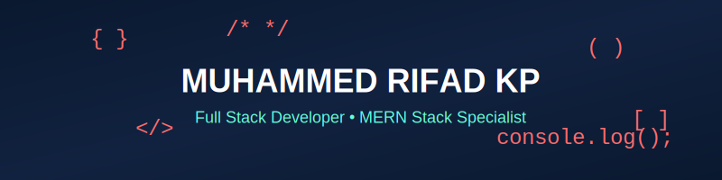
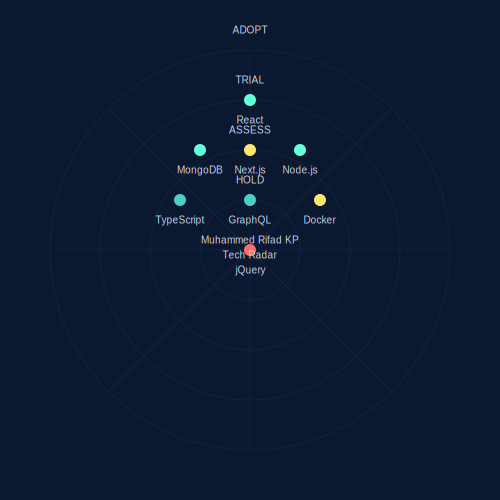

<div align="center">
  
</div>

# 👋 Hello, I'm **Muhammed Rifad KP** 

[](https://github.com/muhammedrifadkp)
[](https://github.com/muhammedrifadkp)
[](https://github.com/muhammedrifadkp)

<div align="center">
  
</div>

---

## 🧩 About Me

I'm a **Full Stack Developer from Kerala, India**, passionate about turning ideas into digital experiences. I specialize in **MERN stack development**, but I also explore new tools and frameworks to stay ahead in modern web tech.

On my portfolio site, I share my journey, projects, and what I'm building next.  
🌐 **Portfolio**: [muhammedrifad.vercel.app](https://muhammedrifad.vercel.app/)  

```javascript
const muhammedRifad = {
  pronouns: "he" | "him",
  code: ["Javascript", "Python", "PHP", "C++"],
  askMeAbout: ["web dev", "tech", "anime", "coffee"],
  technologies: {
      frontend: ["React", "Next.js", "Vite", "Tailwind CSS"],
      backend: ["Node.js", "Express", "REST APIs"],
      databases: ["MongoDB", "MySQL"],
      devOps: ["Docker", "GitHub Actions", "Vercel"],
      tools: ["Git", "GitHub", "Figma", "Postman"]
  },
  architecture: ["Serverless", "Progressive Web Apps", "SPA", "API First Design"],
  currentFocus: "Building scalable web applications",
  funFact: "There are two ways to write error-free programs; only the third one works"
};
```

---

## 🛠️ Tech Stack & Tools

<div align="center">
  
</div>

### 🎯 Skill Progression
<div align="center">
  
</div>

### 📡 Technology Radar
<div align="center">
  
</div>

### 📊 GitHub Activity
<div align="center">
  
</div>

| Area        | Technologies & Tools                         |
|-------------|-----------------------------------------------|
| Frontend    | React, Next.js, Vite, Tailwind CSS, HTML, CSS |
| Backend     | Node.js, Express, REST APIs, Authentication   |
| Database    | MongoDB, Mongoose, MySQL                      |
| DevOps      | Docker, GitHub Actions, Vercel                |
| Tools       | Git, GitHub, npm, Axios, Postman, Figma       |

---

## 🌟 Featured Projects

<div align="center">
  
</div>

### 💼 Portfolio Website
My personal website showcasing my bio, projects, skills, and blog sections.
[Live Demo](https://muhammedrifad.vercel.app/) | [Source Code](#)

### 🛒 E-commerce App
Full MERN stack store with user authentication, admin dashboard, product & order management.
[Source Code](#)

### 💬 Chat App
Realtime chat application using sockets / WebSocket technology.
[Source Code](#)

### 🧩 API Microservices
Small backend services (auth, payment, etc.) using Express / Node.js.
[Source Code](#)

---

## 📈 GitHub Stats

<div align="center">
  
</div>

<div align="center">
  
</div>

<div align="center">
  
</div>

---

## 📫 Let's Connect

<div align="center">
  <a href="mailto:your.email@example.com">
    
  </a>
  <a href="https://www.linkedin.com/in/yourprofile">
    
  </a>
  <a href="https://muhammedrifad.vercel.app/">
    
  </a>
  <a href="https://twitter.com/yourprofile">
    
  </a>
</div>

---

## 🏆 GitHub Trophies

<div align="center">
  
</div>

---

## 🎵 Spotify Playing

<div align="center">
  
</div>

---

## 🚀 Visitor Count

<div align="center">
  
</div>

---

<div align="center">
   
  <em><b>I love connecting with different people</b> so if you want to say <b>hi, I'll be happy to meet you!</b> 😊</em>
</div>

---

<details>
<summary>📊 Contribution Graph</summary>
<br>
<div align="center">
  
</div>
</details>

<details>
<summary>💻 Coding Activity</summary>
<br>
<div align="center">
  
</div>
</details>

---

📌 *Code is poetry, and I write verses.* 🖋️